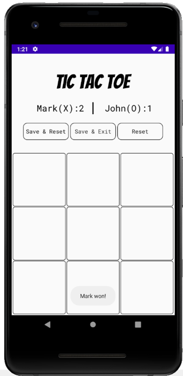

# TicTacToe
This app is a one versus one 2D tic tac toe game. This app is my project for Summer Inhouse Training, June 2020 for Android App Development with Kotlin conducted by Coding Ninjas.
The main idea for developing this app is to learn and improve my Android app developing skills and try to optimize the app's performance as much as possible. And for doing so, I
am constantly updating the app with new code implementation to keep up with the trend.

## Splash Screen

In the splash screen bottom and top animation are used for the text(app title) and image(app icon) repectively.

## Dashboard 

This is the app's main dashboard to navigate to different activities within the app. 
1. Let's Play! - It navigates the user to the tic tac toe playing board. 
2. Show History - It navigates to the Game History activity where saved scores are displayed. 
3. Settings - Settings functionaility is yet to be implemented. App theme(dark or light), About App and Contact Us functionailities are supposed to be implemented under the 
settings of this app. 

## TicTacToe Board

  
