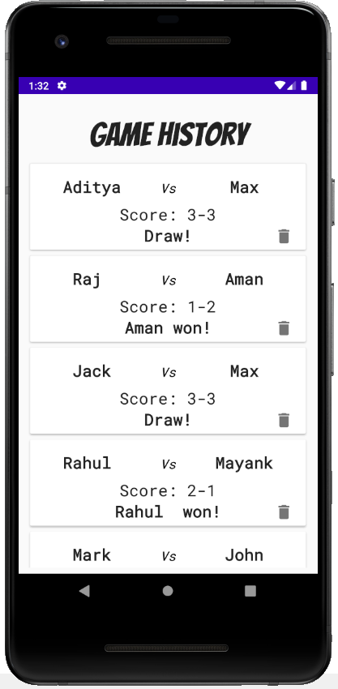

# TicTacToe
This app is a one versus one 2D tic tac toe game. This app is my project for Summer Inhouse Training, June 2020 for Android App Development with Kotlin conducted by Coding Ninjas.
The main idea for developing this app is to learn and improve my Android app developing skills and try to optimize the app's performance as much as possible. And for doing so, I
am constantly updating the app with new code implementation to keep up with the trend.

## Splash Screen

In the splash screen bottom and top animation are used for the text(app title) and image(app icon) repectively.

## Dashboard 

 

This is the app's main dashboard to navigate to different activities within the app. 
1. Let's Play! - It navigates the user to the tic tac toe playing board. 
2. Show History - It navigates to the Game History activity where saved scores are displayed. 
3. Settings -  In Settings we have three functionaties - Theme, Contact Us and App Info.  

## TicTacToe Board
  

This is the playing board for the app. A button array consitutes the major part of this board, on which players can press to place their move and the scores are updated and
displayed at the end of every game and board automatically resets. Also, user can reset manually or save the game score by pressing the respective buttons provided. Reset and 
Save & Reset button resets the board as well as the score board. Players can enter their desired names with help of AlertDialog box which is displayed everytime when the board
activity is created. 

## Game History 
  
The scores of the games played are stored with the help of Room Database and the stored data is displayed in the RecylerView and the CardView. Along with scores, name of player
won or draw declaration is also displayed. A particular game history can be deleted from the database by clicking the delete icon. 

## Settings
  
<I>Theme</I> changes the app theme either light or dark as per user's wish. 
<I>Contact Us</I> you can contact the developers and maintainers of this application for the feedback. 
<I>App Info</I> provides the information of this app. 

## Future development aspects
Two major future developments for this application would be, implementation of the Computer vs Player, 2D tic tac toe with Minimax algo and migration of the app to MVVM 
architecture. These two are the current development aspects I am looking forward to implement. Furthermore, for the optimization of the app's performance new code architecture
and features would be implemented time to time for better user experience. 

